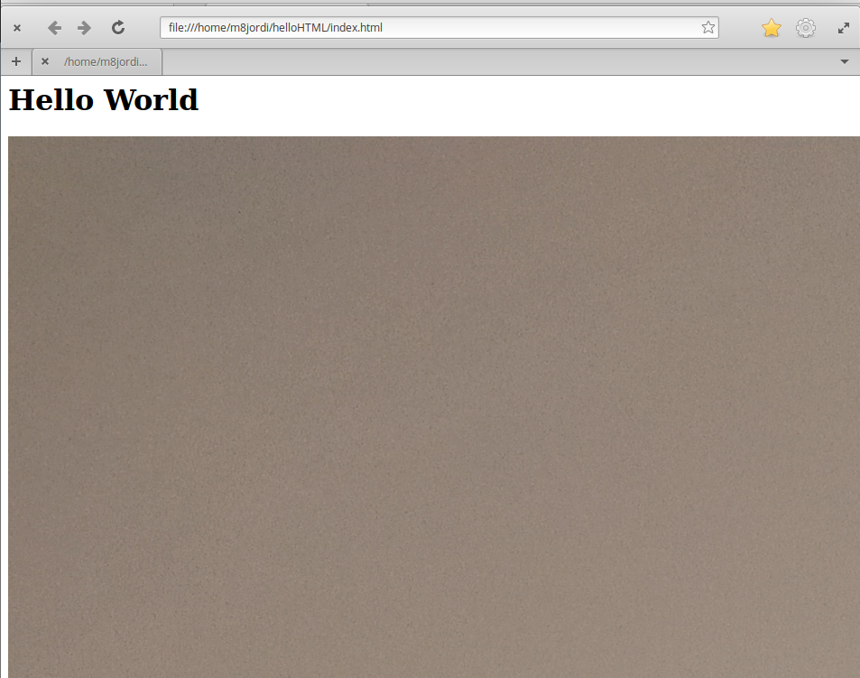

# helloHTML
###### En aquesta pagina web es veura el nom de un company amb la seva foto, per que es sapiga aui es

```
Per descarregar el codi necesitarem utilitzar la comanda git clone per descarregar
Despres modifiquem el fitxer
Posem git .add per guardar los canvis
git commit -m comenten els canvis que hem fet
Per ultim git push origin "aqui posem el nom de la branca"
```
